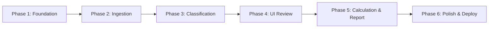
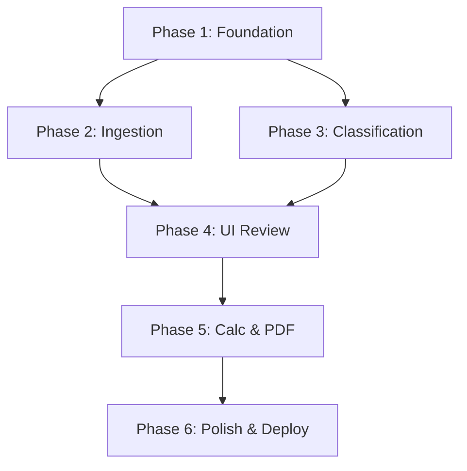

# Roadmap — StorePredict v1.0

## Milestone: v1.0 — MVP Sizing Tool

---

## Phase 1: Project Foundation & DRR Table

**Goal:** Runnable project skeleton with DRR reference data loaded and tested.

**Requirements covered:** FR-2.1, FR-2.2, FR-2.3, FR-2.4, NFR-2.1, NFR-2.2, NFR-2.3, NFR-2.4

**Plans:** 2 plans

Plans:

- [ ] 01-01-PLAN.md — Project structure, data models, DRR table service, and test suite
- [ ] 01-02-PLAN.md — NiceGUI app skeleton, page routing, Dockerfile, docker-compose

**Deliverables:**

- [ ] Python project structure (src/store_predict/, tests/, pyproject.toml)
- [ ] NiceGUI app skeleton (main.py with basic page routing)
- [ ] DRR table service: load CSV, handle edge cases, lookup by category
- [ ] Data models (VM dataclass, FileFormat enum, WorkloadCategory)
- [ ] ruff + mypy configuration
- [ ] pytest setup with conftest.py and DRR table tests
- [ ] Dockerfile + docker-compose.yml (basic)

**Success criteria:** `pytest` passes, `python -m store_predict.main` shows a page, `docker compose up` works.

---

## Phase 2: File Ingestion Pipeline

**Goal:** Parse RVTools and LiveOptics files into a normalized DataFrame.

**Requirements covered:** FR-1.1, FR-1.2, FR-1.3, FR-1.4, FR-1.5, FR-1.6, FR-1.7, FR-1.8

**Deliverables:**

- [ ] Format detection (RVTools vs LiveOptics based on sheet names/columns)
- [ ] RVTools parser: vInfo tab → normalized DataFrame (VM, OS, Provisioned MB, In Use MB)
- [ ] LiveOptics xlsx parser: VMs tab → normalized DataFrame
- [ ] LiveOptics csv parser: same normalization
- [ ] Column fuzzy matching with aliases
- [ ] Template VM filtering
- [ ] Unit conversion: MB → MiB normalization
- [ ] Error handling with clear user messages
- [ ] Tests with real sample files (fixtures from samples/)

**Success criteria:** All 3 parsers produce identical DataFrame schema from sample files. Tests pass with edge cases.

---

## Phase 3: Workload Classification Engine

**Goal:** Auto-classify every VM into a DRR workload category.

**Requirements covered:** FR-3.1, FR-3.2, FR-3.3, FR-3.4

**Deliverables:**

- [ ] ClassificationRule dataclass with priority, patterns, match mode
- [ ] Default rule set covering all 30 DRR categories
- [ ] Rule registry: ordered evaluation, first match wins
- [ ] Substring matching for embedded keywords (CADSRVSQL001 → SQL)
- [ ] OS-based fallback rules (Windows Server → Virtual Machines)
- [ ] Default rule: Unknown (Reducible) DRR=5
- [ ] Classification confidence/rule name tracking
- [ ] Tests for each rule against real VM name patterns from samples

**Success criteria:** Classify sample LiveOptics 610 VMs with >80% reasonable matches. Each DRR category has at least one matching rule.

---

## Phase 4: UI — Upload & Review Pages

**Goal:** Working upload flow + editable classification table with multi-select workload override.

**Requirements covered:** FR-4.1, FR-4.2, FR-4.3, FR-4.4, FR-4.5, FR-4.6, FR-7.1, FR-7.2, FR-7.3, FR-7.4, FR-7.5, FR-7.6

**Deliverables:**

- [ ] Upload page: file dropzone, format auto-detection, project name input
- [ ] Per-session state management (uploaded DataFrame, classifications, overrides)
- [ ] Review page: AG Grid table with VM data + detected workload + DRR
- [ ] Single-select workload dropdown in table cells
- [ ] Multi-select workload dialog (click row → dialog with multi-select)
- [ ] Conservative DRR recalculation on workload change
- [ ] Real-time summary statistics (total VMs, total provisioned, avg DRR)
- [ ] Navigation between Upload → Review
- [ ] Tailwind CSS styling (layout, cards, colors)
- [ ] Dark/light mode toggle with session-persisted preference

**Success criteria:** Upload a LiveOptics file, see classified VMs in table, change workloads, see DRR update.

---

## Phase 5: Calculation & PDF Report

**Goal:** Compute final sizing numbers and generate downloadable one-page PDF.

**Requirements covered:** FR-5.1, FR-5.2, FR-5.3, FR-5.4, FR-6.1, FR-6.2, FR-6.3, FR-6.4, FR-6.5

**Deliverables:**

- [ ] Calculation service: per-VM required capacity, totals, workload grouping
- [ ] Report page: summary cards + workload breakdown table
- [ ] PDF generation with ReportLab: one-page layout, StorePredict branding
- [ ] Unicode font support (DejaVu Sans for French characters)
- [ ] PDF download button
- [ ] Navigation: Review → Report
- [ ] Tests for calculation edge cases (zero storage, single VM, 5000 VMs)
- [ ] Tests for PDF generation (file created, non-empty, expected sections)

**Success criteria:** End-to-end flow: upload file → classify → review → calculate → download PDF.

---

## Phase 6: Polish, Docs & Deployment

**Goal:** Production-ready deployment with documentation.

**Requirements covered:** NFR-1.1, NFR-1.2, NFR-1.3, NFR-3.1, NFR-3.2, NFR-3.3, NFR-4.1, NFR-4.2, NFR-5.1, NFR-5.2, NFR-5.3

**Deliverables:**

- [ ] Docker Compose production config (port, storage secret, restart policy)
- [ ] File upload validation (type check, size limit)
- [ ] Session data isolation verification
- [ ] Log sanitization (no customer data in logs)
- [ ] Performance testing with large files (5000 VMs)
- [ ] MkDocs documentation site (getting started, usage guide, architecture)
- [ ] Mermaid diagrams for architecture docs
- [ ] GitHub Actions: CI (lint, test, type check) + docs deployment
- [ ] README.md with quickstart

**Success criteria:** `docker compose up` serves the app, docs deployed to GitHub Pages, CI green.

---

## Phase Dependencies

Phases 2 and 3 can be developed in parallel after Phase 1 completes.

## Requirement Coverage Matrix

| Requirement | Phase |
|------------|-------|
| FR-1.x (Ingestion) | Phase 2 |
| FR-2.x (DRR Table) | Phase 1 |
| FR-3.x (Classification) | Phase 3 |
| FR-4.x (Review UI) | Phase 4 |
| FR-5.x (Calculation) | Phase 5 |
| FR-6.x (PDF Report) | Phase 5 |
| FR-7.x (UI General, Dark/Light mode) | Phase 4 |
| NFR-1.x (Deployment) | Phase 1 + 6 |
| NFR-2.x (Code Quality) | Phase 1 |
| NFR-3.x (Documentation) | Phase 6 |
| NFR-4.x (Performance) | Phase 6 |
| NFR-5.x (Security) | Phase 6 |
