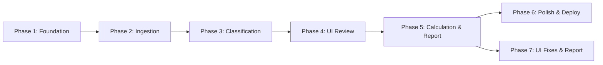
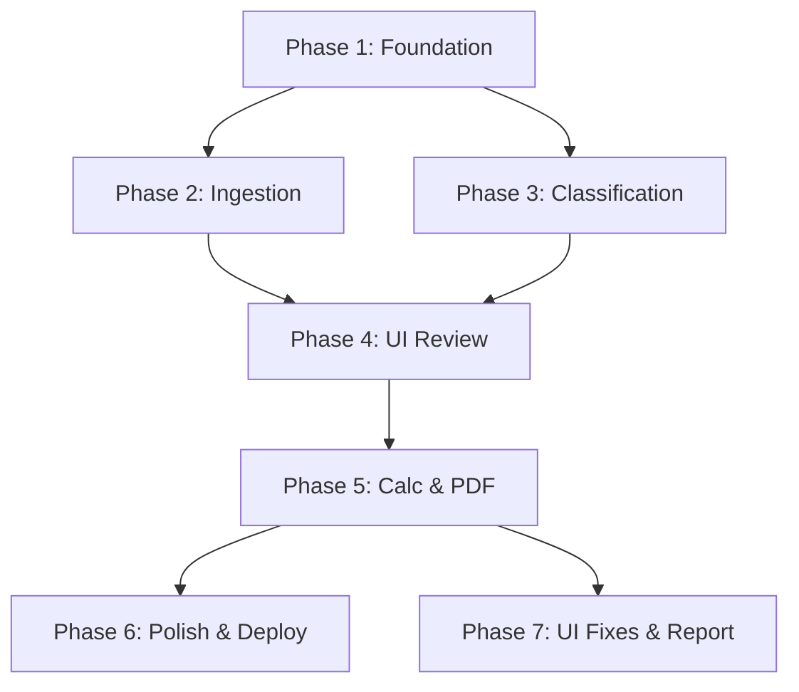

# Roadmap — StorePredict v1.0

## Milestone: v1.0 — MVP Sizing Tool

---

## Phase 1: Project Foundation & DRR Table

**Goal:** Runnable project skeleton with DRR reference data loaded and tested.

**Requirements covered:** FR-2.1, FR-2.2, FR-2.3, FR-2.4, NFR-2.1, NFR-2.2, NFR-2.3, NFR-2.4

**Plans:** 2 plans

Plans:

- [x] 01-01-PLAN.md — Project structure, data models, DRR table service, and test suite
- [x] 01-02-PLAN.md — NiceGUI app skeleton, page routing, Dockerfile, docker-compose

**Deliverables:**

- [x] Python project structure (src/store_predict/, tests/, pyproject.toml)
- [x] NiceGUI app skeleton (main.py with basic page routing)
- [x] DRR table service: load CSV, handle edge cases, lookup by category
- [x] Data models (VM dataclass, FileFormat enum, WorkloadCategory)
- [x] ruff + mypy configuration
- [x] pytest setup with conftest.py and DRR table tests
- [x] Dockerfile + docker-compose.yml (basic)

**Success criteria:** `pytest` passes, `python -m store_predict.main` shows a page, `docker compose up` works.

---

## Phase 2: File Ingestion Pipeline

**Goal:** Parse RVTools and LiveOptics files into a normalized DataFrame.

**Requirements covered:** FR-1.1, FR-1.2, FR-1.3, FR-1.4, FR-1.5, FR-1.6, FR-1.7, FR-1.8

**Plans:** 2 plans

Plans:

- [x] 02-01-PLAN.md — Core parsers (RVTools, LiveOptics xlsx/csv), column alias resolution, IngestionError
- [x] 02-02-PLAN.md — Format detection, ingestion orchestrator, CSV fixture, comprehensive test suite

**Deliverables:**

- [x] Format detection (RVTools vs LiveOptics based on sheet names/columns)
- [x] RVTools parser: vInfo tab → normalized DataFrame (VM, OS, Provisioned MB, In Use MB)
- [x] LiveOptics xlsx parser: VMs tab → normalized DataFrame
- [x] LiveOptics csv parser: same normalization
- [x] Column fuzzy matching with aliases
- [x] Template VM filtering
- [x] Unit conversion: MB → MiB normalization
- [x] Error handling with clear user messages
- [x] Tests with real sample files (fixtures from samples/)

**Success criteria:** All 3 parsers produce identical DataFrame schema from sample files. Tests pass with edge cases.

---

## Phase 3: Workload Classification Engine

**Goal:** Auto-classify every VM into a DRR workload category.

**Requirements covered:** FR-3.1, FR-3.2, FR-3.3, FR-3.4

**Plans:** 2 plans

Plans:

- [x] 03-01-PLAN.md — Classification engine core: ClassificationRule, RuleRegistry, 25+ default rules, classify_dataframe, unit tests
- [x] 03-02-PLAN.md — Integration validation: real sample data classification, DRR consistency checks, coverage report

**Deliverables:**

- [x] ClassificationRule dataclass with priority, patterns, match mode
- [x] Default rule set covering all 28 DRR categories
- [x] Rule registry: ordered evaluation, first match wins
- [x] Substring matching for embedded keywords (CADSRVSQL001 → SQL)
- [x] OS-based fallback rules (Windows Server → Virtual Machines)
- [x] Default rule: Unknown (Reducible) DRR=5
- [x] Classification confidence/rule name tracking
- [x] Tests for each rule against real VM name patterns from samples

**Success criteria:** Classify sample LiveOptics 610 VMs with >80% reasonable matches. Each DRR category has at least one matching rule.

---

## Phase 4: UI — Upload & Review Pages

**Goal:** Working upload flow + editable classification table with multi-select workload override.

**Requirements covered:** FR-4.1, FR-4.2, FR-4.3, FR-4.4, FR-4.5, FR-4.6, FR-7.1, FR-7.2, FR-7.3, FR-7.4, FR-7.5, FR-7.6

**Plans:** 3 plans

Plans:

- [x] 04-01-PLAN.md — Session state module and upload page with pipeline integration
- [x] 04-02-PLAN.md — UI components: AG Grid table, workload dialog, summary stats
- [x] 04-03-PLAN.md — Review page assembly, dark mode toggle, navigation wiring

**Deliverables:**

- [x] Upload page: file dropzone, format auto-detection, project name input
- [x] Per-session state management (uploaded DataFrame, classifications, overrides)
- [x] Review page: AG Grid table with VM data + detected workload + DRR
- [x] Single-select workload dropdown in table cells
- [x] Multi-select workload dialog (click row → dialog with multi-select)
- [x] Conservative DRR recalculation on workload change
- [x] Real-time summary statistics (total VMs, total provisioned, avg DRR)
- [x] Navigation between Upload → Review
- [x] Tailwind CSS styling (layout, cards, colors)
- [x] Dark/light mode toggle with session-persisted preference

**Success criteria:** Upload a LiveOptics file, see classified VMs in table, change workloads, see DRR update.

---

## Phase 5: Calculation & PDF Report

**Goal:** Compute final sizing numbers and generate downloadable one-page PDF.

**Requirements covered:** FR-5.1, FR-5.2, FR-5.3, FR-5.4, FR-6.1, FR-6.2, FR-6.3, FR-6.4, FR-6.5

**Plans:** 3 plans

Plans:

- [x] 05-01-PLAN.md — Calculation service TDD: per-VM required capacity, totals, workload grouping
- [x] 05-02-PLAN.md — PDF report generator with ReportLab Platypus, Vera fonts, and tests
- [x] 05-03-PLAN.md — Report page UI, PDF download button, navigation wiring

**Deliverables:**

- [x] Calculation service: per-VM required capacity, totals, workload grouping
- [x] Report page: summary cards + workload breakdown table
- [x] PDF generation with ReportLab: one-page layout, StorePredict branding
- [x] Unicode font support (Vera fonts for French characters)
- [x] PDF download button
- [x] Navigation: Review → Report
- [x] Tests for calculation edge cases (zero storage, single VM, 5000 VMs)
- [x] Tests for PDF generation (file created, non-empty, expected sections)

**Success criteria:** End-to-end flow: upload file → classify → review → calculate → download PDF.

---

## Phase 6: Polish, Docs & Deployment

**Goal:** Production-ready deployment with documentation.

**Requirements covered:** NFR-1.1, NFR-1.2, NFR-1.3, NFR-3.1, NFR-3.2, NFR-3.3, NFR-4.1, NFR-4.2, NFR-5.1, NFR-5.2, NFR-5.3

**Plans:** 5 plans

Plans:

- [ ] 06-01-PLAN.md -- Docker hardening (.dockerignore, health check, env-var storage secret)
- [ ] 06-02-PLAN.md -- Security (upload validation, log sanitization, session isolation)
- [ ] 06-03-PLAN.md -- Performance tests (5000 VMs classification, PDF benchmark)
- [ ] 06-04-PLAN.md -- MkDocs documentation (architecture with Mermaid, getting-started, README)
- [ ] 06-05-PLAN.md -- GitHub Actions CI + docs deployment

**Deliverables:**

- [ ] Docker Compose production config (port, storage secret, restart policy)
- [ ] File upload validation (type check, size limit)
- [ ] Session data isolation verification
- [ ] Log sanitization (no customer data in logs)
- [ ] Performance testing with large files (5000 VMs)
- [ ] MkDocs documentation site (getting started, usage guide, architecture)
- [ ] Mermaid diagrams for architecture docs
- [ ] GitHub Actions: CI (lint, test, type check) + docs deployment
- [ ] README.md with quickstart

**Success criteria:** `docker compose up` serves the app, docs deployed to GitHub Pages, CI green.

## Phase 7: UI Bug Fixes & Report Enhancements

**Goal:** Fix AG Grid interaction bugs, enrich report with VM statistics, add storage performance sizing from LiveOptics, and improve classification accuracy by filtering company name prefixes.

**Depends on:** Phase 5

**Plans:** 0 plans

Plans:
- [ ] TBD (run /gsd:plan-phase 7 to break down)

**Deliverables:**

*UI Bug Fixes:*
- [ ] Fix multi-row selection in AG Grid (currently broken)
- [ ] Preserve active filters after workload modification
- [ ] Preserve current page position after workload modification
- [ ] Display VM characteristics in review table (including Description field)
- [ ] Allow subcategory selection when changing workload category (currently only category is selectable)
- [ ] Make "Unknown (Reducible)" VMs editable — user must be able to reassign workload and DRR

*Report Enhancements:*
- [ ] Add to PDF report: total number of VMs
- [ ] Add to PDF report: average VM size
- [ ] Add to PDF report: largest VM details

*Storage Performance Sizing (LiveOptics only):*
- [ ] Parse VM Performance sheet (IOPS, throughput, latency) and join with VMs sheet
- [ ] Add performance columns to canonical DataFrame (Peak/Avg IOPS, Peak/Avg MB/s, Peak/Avg Latency)
- [ ] Display performance metrics in review table
- [ ] Include performance summary in PDF report (total IOPS, peak throughput)
- [ ] Compute normalized 8K equivalent IOPS per VM (from IOPS + throughput → single comparable metric)
- [ ] Display 8K equivalent IOPS in review table and PDF report as primary performance indicator
- [ ] Graceful fallback when performance data unavailable (RVTools, LiveOptics CSV)

*Classification Improvement:*
- [ ] Detect and strip company name prefix from VM names before pattern matching
- [ ] Configurable company name patterns (e.g. "ACME-", "CORP") to ignore during classification
- [ ] Use VM Description and Notes fields for classification matching (currently only vm_name + os_name)
- [ ] Parse Description/Notes columns from RVTools (vInfo has "Annotation") and LiveOptics

**Success criteria:** Multi-select works, filters/page survive edits, PDF report includes VM count/avg/largest/performance stats, LiveOptics performance data parsed and displayed, company name prefixes excluded from classification matching.

---

## Phase Dependencies

Phases 2 and 3 can be developed in parallel after Phase 1 completes.

## Requirement Coverage Matrix

| Requirement | Phase |
|------------|-------|
| FR-1.x (Ingestion) | Phase 2 |
| FR-2.x (DRR Table) | Phase 1 |
| FR-3.x (Classification) | Phase 3 |
| FR-4.x (Review UI) | Phase 4 |
| FR-5.x (Calculation) | Phase 5 |
| FR-6.x (PDF Report) | Phase 5 |
| FR-7.x (UI General, Dark/Light mode) | Phase 4 |
| NFR-1.x (Deployment) | Phase 1 + 6 |
| NFR-2.x (Code Quality) | Phase 1 |
| NFR-3.x (Documentation) | Phase 6 |
| NFR-4.x (Performance) | Phase 6 |
| NFR-5.x (Security) | Phase 6 |
