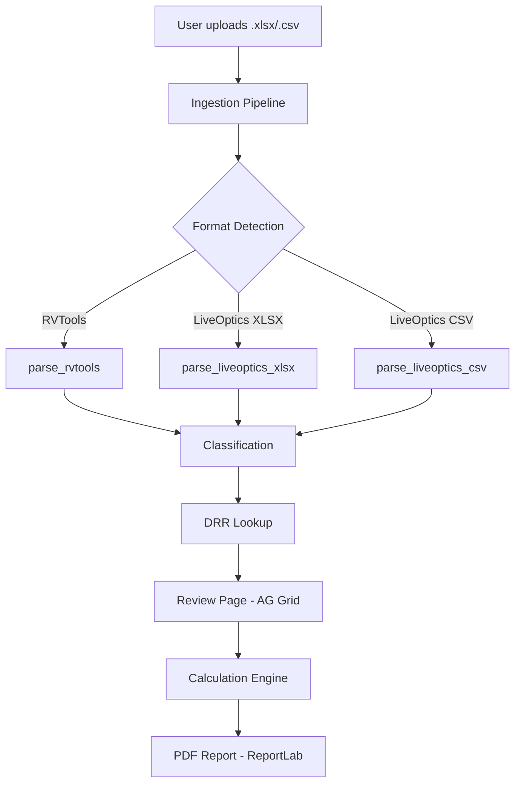

# Phase 6: Polish, Docs & Deployment - Research

**Researched:** 2026-02-19
**Domain:** Docker deployment, MkDocs documentation, GitHub Actions CI/CD, security hardening, performance
**Confidence:** HIGH

## Summary

Phase 6 brings StorePredict to production readiness across five workstreams: (1) Docker Compose hardening, (2) file upload validation and security, (3) session data isolation verification, (4) MkDocs documentation with Mermaid diagrams, and (5) GitHub Actions CI + docs deployment.

The project already has solid foundations: a working Dockerfile with `uv`, a `docker-compose.yml` with port mapping and restart policy, a complete `mkdocs.yml` with Material theme and Mermaid support configured, and an existing `docs/` directory with user guide, ADRs, and research pages. No GitHub Actions workflows exist yet.

Key gaps to address: the `storage_secret` is hardcoded rather than read from an environment variable, no `.dockerignore` exists (builds will be slow/large), no logging framework is in place (needed before log sanitization can be enforced), file upload validation exists at the UI layer (`accept=".xlsx,.csv"` and `max_file_size=50MB`) but no server-side validation of file type beyond extension checking, no `README.md` exists at the project root, and no CI pipeline exists.

**Primary recommendation:** Work sequentially -- Docker hardening first, then security (upload validation, session isolation, log sanitization), then documentation, then CI/CD last since CI depends on all other pieces being in place.

<phase_requirements>

## Phase Requirements

| ID | Description | Research Support |
|----|-------------|-----------------|
| NFR-1.1 | Docker Compose deployment -- single container | Existing `docker-compose.yml` + `Dockerfile` need hardening: `.dockerignore`, env-var `STORAGE_SECRET`, health check |
| NFR-1.2 | App serves on port 8080 by default | Already implemented in `config.py` (`APP_PORT = 8080`) and `docker-compose.yml` (`8080:8080`). Verify only. |
| NFR-1.3 | No external database required -- all state in-memory per session | Already implemented via `app.storage.tab`. Verify no file-system persistence leaks. |
| NFR-3.1 | MkDocs documentation site | `mkdocs.yml` exists with Material theme. Need architecture page, getting-started guide, usage walkthrough. |
| NFR-3.2 | GitHub Actions deployment to GitHub Pages | Use `mkdocs gh-deploy --force` in a GitHub Actions workflow triggered on push to main. |
| NFR-3.3 | Diagrams in Mermaid format (not ASCII art) | Mermaid already configured in `mkdocs.yml` via `pymdownx.superfences`. Create architecture diagrams. |
| NFR-4.1 | Handle xlsx files with up to 5000 VMs without timeout | Need performance test with large fixture. pandas is efficient for this scale; main risk is classification loop. |
| NFR-4.2 | PDF generation under 5 seconds | ReportLab is fast. Need benchmark test with large summary data. |
| NFR-5.1 | Validate uploaded file type (xlsx/csv only) | UI-level `accept=".xlsx,.csv"` exists. Add server-side magic-byte validation in `_handle_upload`. |
| NFR-5.2 | Never log DataFrame contents (VM names, IPs are customer-confidential) | No logging exists yet. Add `logging` module with sanitization guard. Audit all `print()`/`ui.notify()` calls. |
| NFR-5.3 | Per-session data isolation (no cross-user data leakage) | Uses `app.storage.tab` (tab-scoped). Write a test proving two sessions don't share data. |

</phase_requirements>

## Standard Stack

### Core (Already in Project)

| Library | Version | Purpose | Why Standard |
|---------|---------|---------|--------------|
| NiceGUI | >=3.4,<4.0 | Web UI framework | Already chosen (ADR-001) |
| pandas | >=2.2,<4.0 | Data processing | Already in use |
| ReportLab | >=4.0 | PDF generation | Already in use |
| mkdocs-material | latest | Documentation theme | Already configured in `mkdocs.yml` |
| pymdownx.superfences | (via mkdocs-material) | Mermaid diagram rendering | Already configured |
| ruff | >=0.9 | Lint + format | Already in dev deps |
| mypy | >=1.10 | Type checking | Already in dev deps |
| pytest | >=8.0 | Testing | Already in dev deps |

### Supporting (New for Phase 6)

| Library | Version | Purpose | When to Use |
|---------|---------|---------|-------------|
| python-magic / file signatures | N/A | Server-side file type validation | NFR-5.1: Validate uploaded files beyond extension |
| logging (stdlib) | N/A | Structured logging | NFR-5.2: Log sanitization framework |

### Alternatives Considered

| Instead of | Could Use | Tradeoff |
|------------|-----------|----------|
| python-magic for file validation | Manual magic-byte check | python-magic requires libmagic C lib; manual check of XLSX (PK zip header `50 4B 03 04`) and CSV (text heuristic) is simpler and has no extra dependency |
| GitHub Actions `mkdocs gh-deploy` | `actions/deploy-pages` with artifact upload | `mkdocs gh-deploy --force` is simpler (single command), pushes to `gh-pages` branch directly. Official `deploy-pages` action is more complex but better for large sites. For this project, `gh-deploy` is sufficient. |

**Installation:** No new packages needed. All dependencies already in `pyproject.toml`.

## Architecture Patterns

### Recommended Project Structure Additions

```
.github/
  workflows/
    ci.yml              # Lint, type-check, test on PR + push
    docs.yml             # Build + deploy MkDocs to GitHub Pages
docs/
  architecture.md        # NEW: Architecture overview with Mermaid diagrams
  getting-started.md     # NEW: Quickstart guide (Docker + local dev)
  user-guide/
    index.md             # EXISTS: usage walkthrough
.dockerignore            # NEW: Exclude .venv, tests, docs, .git, etc.
README.md                # NEW: Project root quickstart
```

### Pattern 1: Environment-Variable Storage Secret

**What:** Read `STORAGE_SECRET` from environment, with a dev fallback.
**When to use:** Docker production deployment.
**Example:**

```python
# Source: NiceGUI docs - storage_secret parameter
import os

storage_secret = os.environ.get("STORAGE_SECRET", "dev-only-secret")
ui.run(
    title=APP_TITLE,
    port=APP_PORT,
    storage_secret=storage_secret,
    reload=False,
)
```

### Pattern 2: Server-Side File Type Validation (No Extra Dependencies)

**What:** Check file magic bytes before processing, not just extension.
**When to use:** NFR-5.1 -- prevent malicious file uploads.
**Example:**

```python
# XLSX files are ZIP archives: magic bytes PK\x03\x04
XLSX_MAGIC = b"PK\x03\x04"

def validate_upload(content: bytes, filename: str) -> None:
    suffix = Path(filename).suffix.lower()
    if suffix not in (".xlsx", ".csv"):
        raise IngestionError(f"Unsupported file type: {suffix}")
    if suffix == ".xlsx" and not content[:4] == XLSX_MAGIC:
        raise IngestionError("File does not appear to be a valid .xlsx file.")
    # CSV: check it's valid UTF-8 text
    if suffix == ".csv":
        try:
            content[:1024].decode("utf-8")
        except UnicodeDecodeError:
            raise IngestionError("File does not appear to be a valid CSV file.")
```

### Pattern 3: Log Sanitization

**What:** Configure logging that never includes DataFrame contents or customer data.
**When to use:** NFR-5.2 -- all pipeline and UI modules.
**Example:**

```python
import logging

logger = logging.getLogger("store_predict")

# GOOD: Log metadata only
logger.info("Ingested %d VMs from %s format", len(df), fmt.value)

# BAD: Never do this
# logger.debug("DataFrame: %s", df.to_string())
# logger.info("VM names: %s", df["vm_name"].tolist())
```

### Pattern 4: GitHub Actions CI Workflow for Python (uv)

**What:** CI pipeline using `uv` for dependency management.
**When to use:** NFR-3.2 -- runs on every PR and push to main.
**Example:**

```yaml
# Source: GitHub Actions docs + MkDocs Material docs
name: CI
on:
  push:
    branches: [main]
  pull_request:
    branches: [main]

jobs:
  quality:
    runs-on: ubuntu-latest
    steps:
      - uses: actions/checkout@v4
      - uses: actions/setup-python@v5
        with:
          python-version: "3.12"
      - name: Install uv
        run: pip install uv
      - name: Install dependencies
        run: uv venv .venv && . .venv/bin/activate && uv pip install -e ".[dev]"
      - name: Lint
        run: . .venv/bin/activate && ruff check .
      - name: Type check
        run: . .venv/bin/activate && mypy src/
      - name: Test
        run: . .venv/bin/activate && pytest --tb=short
```

### Pattern 5: MkDocs GitHub Pages Deployment

**What:** Dedicated workflow to deploy docs on push to main.
**When to use:** NFR-3.2.
**Example:**

```yaml
# Source: MkDocs Material official docs - publishing-your-site
name: docs
on:
  push:
    branches: [main]
permissions:
  contents: write
jobs:
  deploy:
    runs-on: ubuntu-latest
    steps:
      - uses: actions/checkout@v4
        with:
          fetch-depth: 0
      - name: Configure Git Credentials
        run: |
          git config user.name github-actions[bot]
          git config user.email 41898282+github-actions[bot]@users.noreply.github.com
      - uses: actions/setup-python@v5
        with:
          python-version: 3.x
      - uses: actions/cache@v4
        with:
          key: mkdocs-material-${{ env.cache_id }}
          path: ~/.cache
          restore-keys: mkdocs-material-
      - run: pip install mkdocs-material
      - run: mkdocs gh-deploy --force
```

### Pattern 6: Mermaid Architecture Diagram

**What:** System architecture documented as Mermaid flowchart in MkDocs.
**When to use:** NFR-3.3 -- docs/architecture.md.
**Example:**



### Anti-Patterns to Avoid

- **Logging DataFrame contents:** Never `logger.debug(df)` or `logger.info(df.to_string())`. VM names and IPs are customer-confidential (NFR-5.2).
- **Hardcoded secrets in Docker image:** Never bake `STORAGE_SECRET` into the Dockerfile. Always use environment variables.
- **Global mutable state for session data:** The project correctly uses `app.storage.tab` (tab-scoped). Never use module-level variables to store per-user data.
- **Skipping `.dockerignore`:** Without it, Docker COPY sends `.venv/` (hundreds of MB), `.git/`, `tests/`, `docs/` into the build context, causing slow builds.

## Don't Hand-Roll

| Problem | Don't Build | Use Instead | Why |
|---------|-------------|-------------|-----|
| CI pipeline | Custom scripts | GitHub Actions with `actions/setup-python@v5` + `actions/cache@v4` | Standard, maintained, well-documented |
| Docs deployment | Manual `mkdocs gh-deploy` | GitHub Actions workflow | Automated on every push to main |
| File type detection | Complex MIME parsing | Simple magic-byte check (4 bytes for XLSX zip header) | XLSX is always a ZIP; CSV is always text. Two checks suffice. |
| Session isolation | Custom session middleware | NiceGUI `app.storage.tab` | Already built into the framework, tab-scoped by design |
| Docker health check | Custom monitoring | `HEALTHCHECK` directive in Dockerfile | Built into Docker, works with `docker compose` restart |

**Key insight:** The project already uses the right tools. Phase 6 is about hardening and documenting what exists, not adding new frameworks.

## Common Pitfalls

### Pitfall 1: `.gitignore` Excludes `samples/` but Docker Needs `DRR.csv`

**What goes wrong:** The `.gitignore` excludes `samples/` entirely, but the Dockerfile `COPY samples/DRR.csv samples/DRR.csv` requires this file. If `DRR.csv` isn't tracked in git, CI builds fail.
**Why it happens:** `samples/` contains customer data that should not be committed, but `DRR.csv` is reference data, not customer data.
**How to avoid:** Ensure `DRR.csv` is force-tracked (`git add -f samples/DRR.csv`) or create a `.gitignore` exception: `!samples/DRR.csv`. Currently the Dockerfile already copies it, so it must already be tracked or available.
**Warning signs:** Docker build fails with "COPY failed: file not found".

### Pitfall 2: `storage_secret` Hardcoded in `main.py`

**What goes wrong:** The current `main.py` has `storage_secret="change-me-in-production"` hardcoded. In production Docker deployment, this is insecure -- all users share the same predictable secret.
**Why it happens:** Development convenience.
**How to avoid:** Read from `os.environ.get("STORAGE_SECRET")` with a warning log if using fallback.
**Warning signs:** Security audit flags the hardcoded string.

### Pitfall 3: Missing Server-Side File Validation

**What goes wrong:** The `accept=".xlsx,.csv"` prop is client-side only (Quasar/HTML attribute). A crafted HTTP request can bypass it and upload any file type.
**Why it happens:** UI-level validation feels sufficient but is trivially bypassable.
**How to avoid:** Add server-side validation in `_handle_upload` before calling `ingest_file()`. Check both extension and magic bytes.
**Warning signs:** `ingest_file()` raises cryptic errors on non-xlsx/csv files instead of clean rejection.

### Pitfall 4: Large File Performance Bottleneck in Classification

**What goes wrong:** Classification uses `classify_dataframe()` which applies regex rules row-by-row. With 5000 VMs and many rules, this could be slow.
**Why it happens:** Pattern matching with `re.search` per VM per rule is O(n*m).
**How to avoid:** The current implementation likely uses vectorized pandas operations or compiled regexes. Verify with a benchmark test using a 5000-row synthetic DataFrame. If slow, batch regex matching with `df["vm_name"].str.contains()` is faster.
**Warning signs:** Upload + classification takes >10 seconds for large files.

### Pitfall 5: PDF Generation Memory with Large Reports

**What goes wrong:** ReportLab `SimpleDocTemplate` builds the entire document in memory. With 5000 VMs in the breakdown table, the PDF could be very large.
**Why it happens:** The report currently shows workload groups (categories), not individual VMs. With typical classification, there are ~10-15 groups, so this is not a real risk.
**How to avoid:** Verify that the report aggregates by category (it does -- see `summary.workload_groups`). Individual VM listing would be problematic.
**Warning signs:** PDF file size exceeds 1MB or generation takes >5 seconds.

### Pitfall 6: GitHub Pages Not Enabled

**What goes wrong:** The `mkdocs gh-deploy --force` command pushes to a `gh-pages` branch, but GitHub Pages must be enabled in repo settings to actually serve the site.
**Why it happens:** GitHub Pages requires manual configuration in Settings > Pages > Source: Deploy from branch > `gh-pages`.
**How to avoid:** Document this setup step in README and getting-started guide.
**Warning signs:** Workflow succeeds but docs site returns 404.

## Code Examples

### Docker Health Check

```dockerfile
# Add to Dockerfile
HEALTHCHECK --interval=30s --timeout=5s --start-period=10s --retries=3 \
  CMD python -c "import urllib.request; urllib.request.urlopen('http://localhost:8080')" || exit 1
```

### .dockerignore

```
.venv/
.git/
.github/
.planning/
.mypy_cache/
.pytest_cache/
.ruff_cache/
__pycache__/
tests/
docs/
site/
*.egg-info/
.DS_Store
.env
.coverage
htmlcov/
.store-predict.pid
.store-predict.log
```

### Performance Test Fixture (5000 VMs)

```python
# tests/test_performance.py
import time
import pandas as pd
import pytest
from store_predict.pipeline.classification import RuleRegistry, build_default_rules, classify_dataframe

def make_large_dataframe(n: int = 5000) -> pd.DataFrame:
    """Create a synthetic DataFrame with n VMs for performance testing."""
    names = [f"VM-{i:04d}" for i in range(n)]
    os_values = ["Microsoft Windows Server 2019"] * (n // 2) + ["Red Hat Enterprise Linux 8"] * (n - n // 2)
    return pd.DataFrame({
        "vm_name": names,
        "os": os_values,
        "provisioned_mib": [102400.0] * n,
        "in_use_mib": [51200.0] * n,
        "is_template": [False] * n,
    })

def test_classification_5000_vms_under_10s():
    """NFR-4.1: Classification of 5000 VMs must complete without timeout."""
    df = make_large_dataframe(5000)
    registry = RuleRegistry(build_default_rules())
    start = time.perf_counter()
    result = classify_dataframe(df, registry)
    elapsed = time.perf_counter() - start
    assert len(result) == 5000
    assert elapsed < 10.0, f"Classification took {elapsed:.1f}s, expected <10s"
```

### Session Isolation Test Pattern

```python
# Conceptual test -- NiceGUI's app.storage.tab is inherently tab-scoped
# Verify by checking that storage is dict-based and scoped to client connection
def test_session_data_isolation():
    """NFR-5.3: Verify session data is tab-scoped, not global."""
    from store_predict.ui.state import save_session_data, load_session_data
    # This requires NiceGUI test client or integration test
    # Key verification: app.storage.tab is per-connection, not shared
    # The NiceGUI framework guarantees this by design
```

### README.md Quickstart Structure

```markdown
# StorePredict

PowerStore DRR sizing tool for Dell pre-sales engineers.

## Quickstart (Docker)

docker compose up --build
# Open http://localhost:8080

## Quickstart (Local)

uv venv .venv && source .venv/bin/activate
uv pip install -e ".[dev]"
python -m store_predict.main

## Documentation

https://fjacquet.github.io/store-predict/
```

## State of the Art

| Old Approach | Current Approach | When Changed | Impact |
|--------------|------------------|--------------|--------|
| `pip install` in Dockerfile | `uv pip install` in Dockerfile | 2024+ | 5-10x faster Docker builds. Project already uses this. |
| `actions/checkout@v3` | `actions/checkout@v4` | 2023 | v4 uses Node 20. Always use v4+. |
| `actions/setup-python@v4` | `actions/setup-python@v5` | 2024 | v5 uses Node 20. Use v5. |
| Manual `gh-pages` deployment | `mkdocs gh-deploy --force` in GH Actions | Stable pattern | One-command deployment, pushes to `gh-pages` branch. |
| `pymdownx.superfences` with `mermaid-experimental` class | `mermaid` class (no `-experimental` suffix) | MkDocs Material 8.x+ | Project already uses the correct format. |

**Deprecated/outdated:**
- `actions/checkout@v3`: Use v4 (Node 20 runtime)
- `actions/setup-python@v4`: Use v5 (Node 20 runtime)
- `mermaid-experimental` fence class: Use `mermaid` (already correct in project)

## Open Questions

1. **`samples/DRR.csv` git tracking status**
   - What we know: `.gitignore` excludes `samples/` but Dockerfile copies `samples/DRR.csv`
   - What's unclear: Is `DRR.csv` force-tracked or does a `.gitignore` exception exist?
   - Recommendation: Verify with `git ls-files samples/DRR.csv`. If not tracked, add exception to `.gitignore`.

2. **NiceGUI integration testing for session isolation**
   - What we know: `app.storage.tab` is tab-scoped by framework design
   - What's unclear: How to write an automated test with two concurrent NiceGUI clients
   - Recommendation: Document the architectural guarantee (tab-scoped storage) rather than building a complex multi-client test harness. A simpler unit test can verify `save_session_data` / `load_session_data` round-trip.

3. **GitHub Pages repository configuration**
   - What we know: `mkdocs gh-deploy` pushes to `gh-pages` branch
   - What's unclear: Whether GitHub Pages is already enabled in repo settings
   - Recommendation: Document the manual step in README. Cannot be automated via CI.

## Sources

### Primary (HIGH confidence)
- NiceGUI official docs (Context7: `/websites/nicegui_io`) -- storage, upload, deployment, session management
- MkDocs Material official docs (Context7: `/websites/squidfunk_github_io_mkdocs-material`) -- Mermaid setup, GitHub Actions deployment, publishing
- GitHub Actions official docs (Context7: `/websites/github_en_actions`) -- workflow syntax, Python CI, deployment triggers

### Secondary (MEDIUM confidence)
- Project source code analysis -- `main.py`, `upload.py`, `state.py`, `config.py`, `Dockerfile`, `docker-compose.yml`, `mkdocs.yml`, `pyproject.toml`, `.gitignore`

### Tertiary (LOW confidence)
- None. All findings verified with official documentation.

## Metadata

**Confidence breakdown:**
- Standard stack: HIGH -- all libraries already in use, versions verified in `pyproject.toml`
- Architecture: HIGH -- patterns derived from official NiceGUI and MkDocs Material documentation
- Pitfalls: HIGH -- identified through source code analysis and cross-referenced with framework docs
- CI/CD: HIGH -- GitHub Actions workflow patterns from official MkDocs Material publishing guide

**Research date:** 2026-02-19
**Valid until:** 2026-03-19 (stable stack, no fast-moving dependencies)
