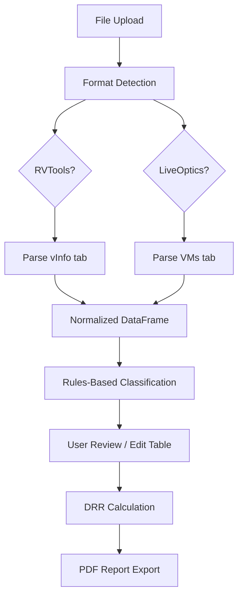

# Research Summary — StorePredict

## Stack Decisions (Confirmed)

| Choice | Rationale |
|--------|-----------|
| **NiceGUI 2.x** | Full Python, native Tailwind CSS via `.classes()`, AG Grid for editable tables |
| **ReportLab** (not WeasyPrint) | No system deps, +5MB vs +400MB in Docker, sufficient for one-page report |
| **pandas + openpyxl** | Standard xlsx/csv parsing, DataFrame pipeline |
| **Python 3.12** | Latest stable, good typing support |
| **ruff + mypy** | Fast linting + type checking |
| **pytest** | Service-layer unit tests (no UI testing in v1) |

## Input Format Findings (Verified from Samples)

### RVTools (samples/rvtools.xlsx — verified)

- **Tab:** vInfo (71 columns)
- **Key columns:** VM, Powerstate, Template, OS according to the VMware Tools, Provisioned MB, In Use MB, Datacenter, Cluster
- **Units:** MB (not MiB)
- **Gotcha:** Column "VM" not "VM Name", filter Template="True" rows

### LiveOptics (samples/live-optics.xlsx — verified)

- **Tab:** VMs (38 columns), 610 VMs in sample
- **Key columns:** VM Name, VM OS, Guest VM Disk Capacity (MiB), Guest VM Disk Used (MiB), Virtual Disk Size (MiB)
- **Units:** MiB
- **Gotcha:** Multiple export types in ZIP (VMWARE, GENERAL, AIR, PERF) — must detect correct file

### DRR.csv (samples/DRR.csv — verified, 4 issues found)

- Semicolon-delimited, 30 categories, ratios 1-8
- **Issues:** Embedded newline in PostgreSQL entry, trailing empty rows, stray line 35, no explicit header

## Architecture Pattern

**Critical boundary:** `pipeline/` package has zero imports from `ui/`. Business logic is fully testable without NiceGUI.

## Classification Insights

- VM names use embedded keywords: "CADSRVSQL001" contains "SQL" — use substring match, NOT word boundary
- Naming patterns: SITE-FUNCTION-NUM, descriptive, product names
- Priority order: Database > Application > Infrastructure > OS fallback > Default (DRR=5)

## Top Risks

| # | Risk | Severity | Mitigation |
|---|------|----------|------------|
| 1 | openpyxl + NumPy version clash | Critical | Pin versions, test in CI |
| 2 | RVTools column name variations | Critical | Fuzzy column matching with aliases |
| 3 | DRR.csv parsing traps | Critical | Robust CSV loading with validation |
| 4 | French chars in PDF (ReportLab) | Moderate | Bundle DejaVu Sans font |
| 5 | AG Grid multi-select limitation | Moderate | Dialog-based multi-select pattern |
| 6 | Large file upload memory | Moderate | openpyxl read_only mode, file size limit |

## Roadmap Implications

1. DRR.csv parsing must come first — feeds everything
2. LiveOptics ingestion before RVTools — verified sample data available
3. Single-select workload in v1, multi-select adds dialog complexity
4. VM Performance tab integration deferred to future version
5. Documentation uses Mermaid diagrams (not ASCII art)
