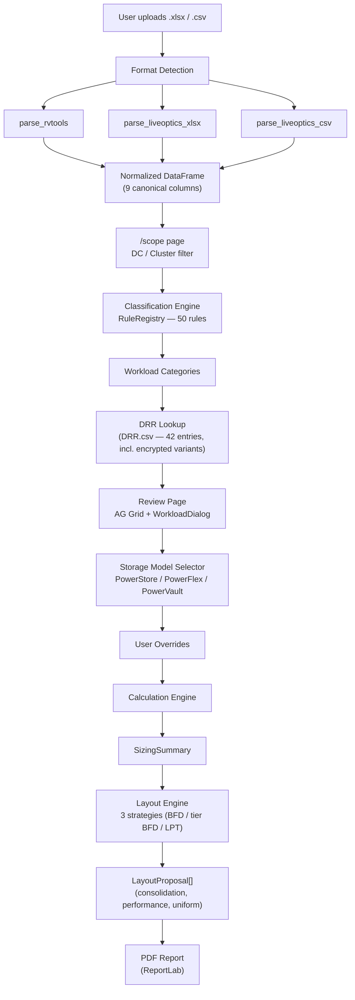
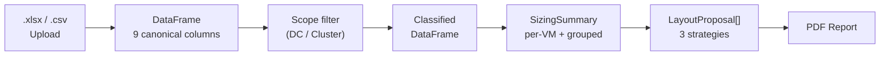
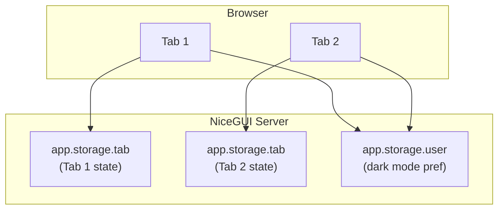

# Architecture

## Overview

StorePredict is a full-Python web application for Dell pre-sales engineers.
It implements a **5-stage pipeline** that ingests VMware workload exports,
lets engineers filter by datacenter/cluster scope, classifies virtual machines
into workload categories, predicts Data Reduction Ratios (DRR) for Dell
PowerStore arrays, and produces datastore layout recommendations using three
placement strategies.

The result is a one-page PDF sizing report that pre-sales engineers can
present to customers with defensible capacity numbers and optimal datastore
layout proposals.

## Pipeline Architecture

## Data Flow

The canonical columns after ingestion are:

| Column | Description |
|--------|-------------|
| `vm_name` | Virtual machine name |
| `os` | Guest OS as reported by VMware Tools |
| `provisioned_mib` | Total provisioned disk (MiB) |
| `in_use_mib` | Actual disk usage (MiB) |
| `cpu_count` | Number of vCPUs |
| `memory_mib` | Allocated RAM (MiB) |
| `power_state` | Power state (on/off) |
| `is_template` | Whether the VM is a template |
| `source_format` | Origin format (rvtools / liveoptics) |

## Key Components

### Parsers

- **`pipeline/parsers/rvtools.py`** -- Parses RVTools `.xlsx` exports (vInfo tab).
- **`pipeline/parsers/liveoptics.py`** -- Parses LiveOptics `.xlsx` and `.csv` exports (VMs tab).
- **`pipeline/parsers/columns.py`** -- Column alias resolution via dict lookup for format normalization.

### Classification

- **`pipeline/classification.py`** -- Rule-based classification engine with 50 priority-ordered rules.
  Each rule matches patterns in VM name and OS fields to assign workload categories
  (e.g., SQL, Oracle, VDI, SAP). Windows Desktop OS VMs (Win 10/11/7) fall back to
  VDI Linked Clone rather than the generic Virtual Machines bucket (ADR-065).

### DRR Table

- **`services/drr_table.py`** -- Loads the reference DRR table from `src/store_predict/data/DRR.csv`
  (semicolon-delimited, 42 entries). Maps workload categories and subcategories to
  reduction ratios, including application-level encryption/compression variants
  (Oracle TDE, SQL Server Page Compression, DDVE, etc.).

### Storage Model

- **`config.py` — `StorageModel` enum** — Three target platforms with different
  data-reduction capabilities:

  | Platform | Dedup | Compression | DRR source |
  |----------|-------|-------------|------------|
  | PowerStore | ✅ | ✅ | Per workload from DRR.csv |
  | PowerFlex | ❌ | ✅ | Flat 2.0 |
  | PowerVault | ❌ | ❌ | Flat 1.0 |

- **`services/drr_table.py` — `apply_storage_model()`** -- Overwrites per-VM DRR
  values in session based on the selected platform. Called on every review page load
  and on toggle change.
- **`ui/state.py` — `get/set_storage_model()`** -- Persists the selection in
  `app.storage.tab["storage_model"]`.

### Calculation

- **`services/calculation.py`** -- Computes per-VM required capacity as
  `Provisioned / DRR`. For multi-workload VMs, uses the lowest (most conservative)
  DRR. Weighted average DRR = `total_provisioned / total_required`.

### Layout Engine

- **`pipeline/layout_models.py`** — Frozen dataclasses for layout domain:
  `PlacementConstraints` (4 TiB DS, 25 VMs/DS, 100K IOPS/DS defaults),
  `DatastoreRecommendation` (immutable DS snapshot with assigned VMs),
  `LayoutMetrics` (15-field aggregate metrics),
  `LayoutProposal` (strategy name + datastores + metrics).
  Also provides `DEFAULT_IOPS_BY_WORKLOAD` loaded from `src/store_predict/data/IOPS.csv`.

- **`pipeline/layout_engine.py`** — Three layout strategies producing datastore
  placement recommendations:
  - **Consolidation:** Multi-dimensional BFD bin-packing minimizing datastore count
  - **Performance:** Phase 0 mission-critical isolation (SAP HANA, Exchange, >2 TiB,
    >5000 IOPS) + three-tier (HOT/WARM/COLD) independent BFD
  - **Uniform:** LPT (Longest Processing Time) across pre-computed equal-sized bins
  - `generate_all_proposals()` — Public entry point returning all 3 strategies

### PDF Report

- **`services/pdf_report.py`** -- Generates a branded one-page PDF using ReportLab
  with Vera/VeraBd fonts for French character support.

### Session Persistence

- **`pipeline/session_archive.py`** — Self-contained session archive module.
  `save_session_zip()` serialises the full `app.storage.tab` state plus the
  original uploaded file into a `.zip` archive. `restore_session_zip()` reads
  the archive and returns a flat dict ready to write back to `app.storage.tab`.
  `is_session_zip()` detects StorePredict archives via the `session.json`
  sentinel without parsing JSON (see ADR-066, ADR-067).

### Concerns Export

- **`services/concerns_export.py`** — Pure-service module (zero UI imports) for
  standalone concerns exports. `generate_concerns_pdf()` produces an A4 ReportLab
  PDF with severity-coloured tables and remediation hints. `generate_concerns_csv()`
  produces a UTF-8-BOM CSV with one row per finding. Both functions accept a
  `HealthCheckResult` and return raw bytes (see ADR-069).

### Scope Filtering

- **`ui/pages/scope_page.py`** -- `/scope` page rendered between upload and review.
  Reads `datacenter` and `cluster` columns from the canonical DataFrame and presents
  multi-select pickers. Persists selection via `save_scope_selection()`.

### Session State

- **`ui/state.py`** -- Tab-scoped session storage via `app.storage.tab`.
  Each browser tab maintains independent pipeline state. Key scope helpers:
  - `save_scope_selection(datacenters, clusters)` — persist selected sets
  - `get_scope_selection()` — retrieve `(set[str], set[str])`
  - `load_filtered_session_data()` — return DataFrame filtered to selected scope
  - `save_filtered_rows(row_data)` — merge AG Grid edits back into the full dataset

## Session Model

- **Tab-scoped** (`app.storage.tab`): uploaded file, DataFrame, classification results,
  SizingSummary, selected storage model, AI toggle state, scope selection
  (selected datacenters and clusters), layout constraints.
  The full tab state can be serialised to a portable `.zip` archive via
  `pipeline/session_archive.py` and restored on a subsequent upload.
- **User-scoped** (`app.storage.user`): dark mode preference (persists across pages and tabs).

## Technology Stack

| Layer | Technology |
|-------|-----------|
| Web framework | [NiceGUI](https://nicegui.io/) |
| Styling | Tailwind CSS |
| Data grid | AG Grid (Community) |
| Data processing | pandas, openpyxl |
| PDF generation | ReportLab |
| Testing | pytest |
| Linting | ruff, mypy |
| Documentation | MkDocs Material |
| Deployment | Docker Compose |
