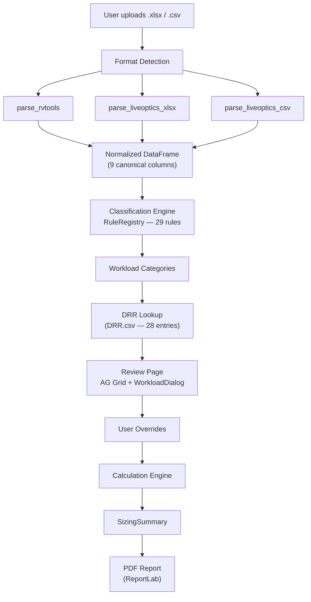
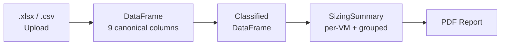
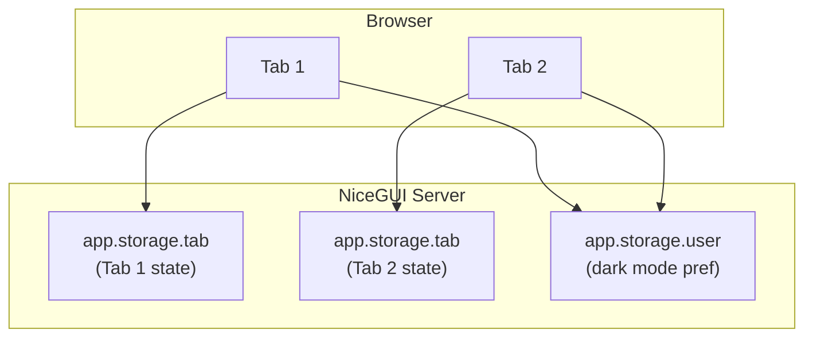

# Architecture

## Overview

StorePredict is a full-Python web application for Dell pre-sales engineers.
It implements a **3-stage pipeline** that ingests VMware workload exports,
classifies virtual machines into workload categories, and predicts
Data Reduction Ratios (DRR) for Dell PowerStore arrays.

The result is a one-page PDF sizing report that pre-sales engineers can
present to customers with defensible capacity numbers.

## Pipeline Architecture

## Data Flow

The canonical columns after ingestion are:

| Column | Description |
|--------|-------------|
| `vm_name` | Virtual machine name |
| `os` | Guest OS as reported by VMware Tools |
| `provisioned_mib` | Total provisioned disk (MiB) |
| `in_use_mib` | Actual disk usage (MiB) |
| `cpu_count` | Number of vCPUs |
| `memory_mib` | Allocated RAM (MiB) |
| `power_state` | Power state (on/off) |
| `is_template` | Whether the VM is a template |
| `source_format` | Origin format (rvtools / liveoptics) |

## Key Components

### Parsers

- **`pipeline/parsers/rvtools.py`** -- Parses RVTools `.xlsx` exports (vInfo tab).
- **`pipeline/parsers/liveoptics.py`** -- Parses LiveOptics `.xlsx` and `.csv` exports (VMs tab).
- **`pipeline/parsers/columns.py`** -- Column alias resolution via dict lookup for format normalization.

### Classification

- **`pipeline/classification.py`** -- Rule-based classification engine with 29 priority-ordered rules.
  Each rule matches patterns in VM name and OS fields to assign workload categories
  (e.g., SQL, Oracle, VDI, SAP).

### DRR Table

- **`services/drr_table.py`** -- Loads the reference DRR table from `samples/DRR.csv`
  (semicolon-delimited, 28 entries). Maps workload categories to reduction ratios.

### Calculation

- **`services/calculation.py`** -- Computes per-VM required capacity as
  `Provisioned / DRR`. For multi-workload VMs, uses the lowest (most conservative)
  DRR. Weighted average DRR = `total_provisioned / total_required`.

### PDF Report

- **`services/pdf_report.py`** -- Generates a branded one-page PDF using ReportLab
  with Vera/VeraBd fonts for French character support.

### Session State

- **`ui/state.py`** -- Tab-scoped session storage via `app.storage.tab`.
  Each browser tab maintains independent pipeline state.

## Session Model

- **Tab-scoped** (`app.storage.tab`): uploaded file, DataFrame, classification results, SizingSummary.
- **User-scoped** (`app.storage.user`): dark mode preference (persists across pages and tabs).

## Technology Stack

| Layer | Technology |
|-------|-----------|
| Web framework | [NiceGUI](https://nicegui.io/) |
| Styling | Tailwind CSS |
| Data grid | AG Grid (Community) |
| Data processing | pandas, openpyxl |
| PDF generation | ReportLab |
| Testing | pytest |
| Linting | ruff, mypy |
| Documentation | MkDocs Material |
| Deployment | Docker Compose |
